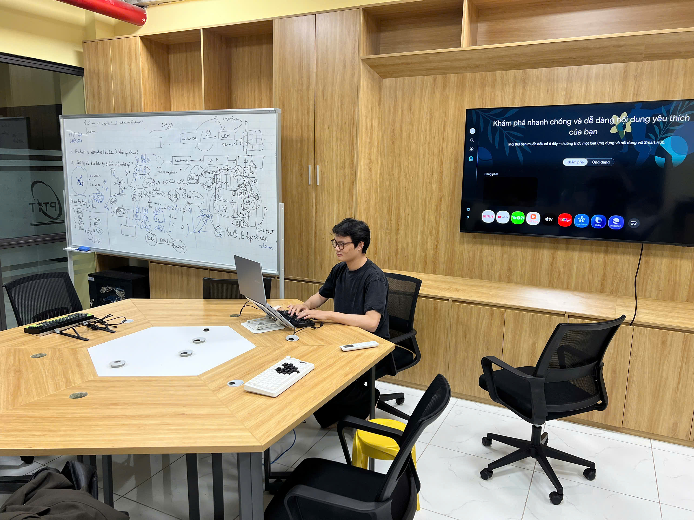

# XEye
[](LICENSE)

> XEye is currently among the **Top 28 shortlisted startups** of [**Qualcomm® Vietnam Innovation Challenge (QVIC) 2026**](https://www.qualcomm.com/company/locations/vietnam/vietnam-innovation-challenge#qvic-2026).  

XEye is a wearable, on-device AI assistant for the visually impaired, built on [Qualcomm Dragonwing™ QCS6490](https://www.qualcomm.com/internet-of-things/products/q6-series/qcs6490) Platform - [Thundercomm RUBIK Pi 3](https://rubikpi.ai/).

**Technical Notes:** [English](docs/technical_report.md) · [Tiếng Việt](docs/bao_cao_ky_thuat.md) *(Last updated: 17/08/2026)*

## Pipeline

```
Mic ─────────→ STT ─────────→  VI question (text input)
                                        ↓
Camera ────→ Image input ────→ Vision Language Model
                                        ↓
                               VI answer (text output)
                                        ↓
                                       TTS ────→ VI answer (audio output) ────→ Speaker playback
```

## Hardware

| | |
|---|---|
| **Board** | [Thundercomm RUBIK Pi 3](https://rubikpi.ai/) |
| **SoC** | Qualcomm QCS6490 |
| **CPU** | 4× Cortex-A55 @1.96GHz + 3× Cortex-A78 @2.40GHz + 1× Cortex-X1 @2.71GHz |
| **RAM** | 8GB LPDDR4x |
| **NPU** | Hexagon 780 (V73) — 12 TOPS |
| **GPU** | Adreno 643 |
| **Camera** | Raspberry Pi Camera Module 3 (IMX708), CSI connector 2 — captured via GStreamer `qtiqmmfsrc`, rotated 180° on capture. Substituted after the Module 2 stopped probing; autofocus is unsupported on this board |
| **Audio** | Seeed Studio ReSpeaker Lite (USB) — mic array + speaker out |
| **Button** | 3-pin momentary module with onboard pull-up — signal on pin 16 (`GPIO_26`), active-low. A bare 2-pin switch does not work here: without a resistor the line floats on release and latches |
| **Power** | 3S2P Li-ion pack (6× 18650), 11.1V nominal, ~55.5 Wh — 1-2h under full load, 4-5h idle. Fed through a DC-DC module with USB-C PD output, since the board requires PD 3.0 at 12V/3A and will not boot without it |
| **OS** | Ubuntu (Linux 6.8.0-1071-qcom) |

## Models

| Module | Model | Runtime | Quantization | Performance |
|--------|-------|---------|--------------|-------------|
| VAD | [Silero VAD](https://github.com/snakers4/silero-vad) | sherpa-onnx | fp32 | 629KB, ends the question 0.8s after you stop |
| STT | [ZipFormer-30M RNNT](https://huggingface.co/hynt/Zipformer-30M-RNNT-6000h) | sherpa-onnx | int8 | RTF 0.03-0.07x |
| VLM | [Vintern-1B-v3_5](https://huggingface.co/dekthedev/Vintern-1B-v3_5-GGUF) | llama-cpp-python | Q4_K_M | ~17-21s per image |
| TTS | [VieNeu-TTS-v3-Turbo](https://huggingface.co/pnnbao-ump/VieNeu-TTS-v3-Turbo) | onnxruntime | int8 | RTF 0.80-0.97x |

### Measured latency

Numbers below are from the running server on the RUBIK Pi 3, using the demo photo (2568×1926, downscaled by the server to 960×720). Warm — the first request after startup is slower.

| Stage | Measurement |
|-------|-------------|
| STT | 0.05-0.11s to decode 1.8s of audio (RTF 0.03-0.07x) |
| VLM — image encode | 12.5-13.9s (mmproj/clip, fixed cost per image) |
| VLM — image prefill | 3.8-3.9s (256 image tokens) |
| VLM — total | 17-21s per image |
| TTS | RTF 0.80-0.97x — 0.6-0.7s for 8 chars, 3.3-4.0s for a typical 80-char answer, 9.1-10.2s for 203 chars |
| **Time to first sound** | **~20s** (speech starts after the first sentence, not the whole answer) |
| **End-to-end** | **~24-26s** |

The camera capture runs during the recording window, and synthesis runs one sentence ahead of playback, so neither shows up in the total. Server startup to first servable request is 12.9s.

> **On `tok_s`:** the `/vlm` endpoint reports `tokens ÷ total elapsed`, and total elapsed includes the ~16-18s fixed image cost. It therefore rises with answer length — **3.0-3.7 tok/s** for a full description (58-75 tokens), ~1.0-1.7 tok/s for a short one-line answer. It is not a pure decode rate.

> **Sustained use:** the SoC reaches 82-89°C under continuous inference and cpu7 throttles from 2707 to ~2035MHz. Image encode rises from 13.3s cold to a **plateau of 15.3s** after ~10 requests and stays flat — the device settles ~2s slower, it does not degrade continuously.

> **Why CPU-only?**  
> The QCS6490's Hexagon NPU (12 TOPS) is designed for computer vision inference (object detection, classification) — not LLM/VLM workloads. It does not efficiently support attention mechanisms, dynamic KV cache, or large matrix multiplications required by language models. The Adreno GPU shares system RAM, making it unsuitable for models that require several GB of memory. After extensive testing across multiple approaches (llama.cpp Hexagon backend, ONNX Runtime QNN EP, Qualcomm AI Hub), CPU inference with highly quantized models was the only viable path on this hardware.

## Setup

```bash
# 1. Create environment and install dependencies
bash setup.sh

# 2. Activate environment
conda activate xeye

# 3. Download all models (~1.4GB total)
python download_models.py

# 4. Start server
python server.py
```

Models are split across two locations: the VLM and STT weights land in `models/` (~1.1GB), while the TTS ONNX graphs and the MOSS audio tokenizer go to the HuggingFace cache (`~/.cache/huggingface/hub`, ~286MB), where the `vieneu` package loads them from.

> `setup.sh` installs `vieneu` with `--no-deps` — the package declares `gradio` as a hard dependency, which the board does not need. Its actual runtime requirements are listed in `requirements.txt`.

> **Updating a board?** Follow [docs/board_checklist.md](docs/board_checklist.md) — dependency and model updates, the one-time button GPIO lookup, volume persistence, smoke tests and troubleshooting.

## Testing AI Services

Server must be running before using any script (`python server.py`). The commands below use the sample files in `demo/` (`data/` is a scratch directory and is not tracked in git).

### STT

```bash
python scripts/stt_infer.py --file demo/audio/question.wav
```

### VLM

```bash
# Describe image (no question — uses default prompt)
python scripts/vlm_infer.py demo/images/IMG_6817.jpg

# Ask a Vietnamese question
python scripts/vlm_infer.py demo/images/IMG_6817.jpg --question "Đây là gì?"
```

### TTS

```bash
# Synthesize to file
python scripts/tts_infer.py "Xin chào" --out data/audio/output.wav

# Synthesize with a different voice
python scripts/tts_infer.py "Xin chào" --out data/audio/output.wav --voice "Phạm Tuyên"
```

### Camera preview

Live MJPEG preview for aiming the camera and checking focus — open `http://<board-ip>:8080/`:

```bash
python scripts/camera_preview.py
python scripts/camera_preview.py --ev 4 --rotate 90    # brighter, and rotated if side-mounted
```

Capture uses `exposure-compensation=2` (range −12..12). On the IMX708 there is headroom above that: +2 and +4 measured 126.9 and 133.7 mean brightness with *identical* contrast (44.1 vs 44.7) and only 4.2%/5.8% blown pixels. The earlier 22%/29% figures were the IMX219 and do not carry over — this setting is sensor-specific. Exposure stays on auto rather than pinning the shutter: a fixed shutter would cut motion blur but costs ~7.6 stops of adaptation between indoors and sunlight, and a blown frame describes worse than a soft one. Auto-exposure needs ~5 frames to settle, so the first moment of any stream is dark. Only one viewer at a time: the camera allows a single consumer.

> Requesting an unsupported mode **crashes `cam-server`** rather than erroring — 960×720 and 1920×1080 both do. Stay on 1280×720. Requesting 4:3 also crops ~33% of the horizontal field rather than adding view.

## API Server

Runs at `http://0.0.0.0:8000`

| Endpoint | Method | Input | Output |
|----------|--------|-------|--------|
| `/health` | GET | — | `{"status": "ok", "models": ["stt", "vlm", "tts"]}` |
| `/stt` | POST | WAV file (multipart) | `{"text": "..."}` |
| `/vlm` | POST | `image` (file), `question` (Vietnamese, optional) | `{"vi": "...", "tokens": N, "elapsed_s": N, "tok_s": N}` |
| `/tts` | POST | `text` (Vietnamese), `voice` (name, optional) | WAV audio bytes |

`/vlm` downscales the image to fit within 1280×720, caps generation at 128 tokens, and uses `repeat_penalty=1.1` (llama-cpp-python defaults to 1.0, i.e. disabled, which lets the model fall into repetition loops). It appends `" Trả lời bằng tiếng Việt."` to every prompt — without it the model replies in English ~half the time on empty or nonsense questions. With no `question`, it falls back to the prompt `"Mô tả những gì bạn thấy."`. `/stt` expects 16kHz mono WAV; `/tts` returns 48kHz mono WAV, synthesized with the `tu_nhien` style and no audio watermark.

Endpoints run in FastAPI's threadpool with model access serialized by a lock, so `/health` stays responsive (5-9ms) while inference is running.

### Example calls

```bash
# Health check
curl http://localhost:8000/health

# STT
curl -X POST http://localhost:8000/stt \
  -F "audio=@demo/audio/question.wav"

# VLM
curl -X POST http://localhost:8000/vlm \
  -F "image=@demo/images/IMG_6817.jpg" \
  -F "question=Đây là gì?"

# TTS
curl -X POST http://localhost:8000/tts \
  -F "text=Xin chào" \
  -F "voice=Mai Anh" \
  --output response.wav
```

### TTS Voices

14 built-in voices — 7 female, 7 male, across all three dialects:

| Name | Gender | Dialect | Name | Gender | Dialect |
|------|--------|---------|------|--------|---------|
| `Mai Anh` | Female | Northern **(default)** | `Thục Đoan` | Female | Southern |
| `Trúc Ly` | Female | Northern | `Thùy Dung` | Female | Southern |
| `Đoan Trang` | Female | Northern | `Xuân Vĩnh` | Male | Southern |
| `Ngọc Linh` | Female | Northern | `Thái Sơn` | Male | Southern |
| `Phạm Tuyên` | Male | Northern | `Minh Triết` | Male | Southern |
| `Thanh Bình` | Male | Northern | `Ngọc Trân` | Female | Central |
| `Minh Đức` | Male | Northern | `Quang Sơn` | Male | Central |

Every voice is rendered with the `tu_nhien` (natural) style rather than its own preset style — the `tin_tuc` and `doc_truyen` styles insert mid-sentence pauses that break up short answers.

v3 can also clone a voice from a 3–5s reference clip; XEye does not expose that through the API.

## Demo

```bash
# Device mode: press the button to ask, repeatedly (Ctrl-C to stop)
python pipeline.py --button

# One question, triggered from the terminal
python pipeline.py

# Wait longer before deciding the question ended, or keep the answer silent
python pipeline.py --silence 1.0
python pipeline.py --no-play

# Replay from files instead of live hardware
python pipeline.py demo/audio/question.wav --image demo/images/IMG_6817.jpg
```

With no arguments the pipeline records from the ReSpeaker mic array at 16kHz until you stop speaking, captures a frame from the camera, and plays the spoken answer back through the ReSpeaker's speaker. The ALSA device is located by card name, so it survives card-order changes. Either input can be overridden by passing a WAV path or `--image`.

There is no fixed recording window — Silero VAD ends the question `--silence` seconds (default 0.8) after you stop talking, and only the trimmed speech is sent to `/stt`. Two guards bound it: `--max-record` (default 12s) caps a single question, and the pipeline gives up if nobody speaks within 6s. Raise `--silence` if it cuts you off mid-question; lower it if the wait after speaking feels long.

`--button` is the mode the wearable actually runs in: it waits for a press, answers, and goes back to waiting, so no terminal is needed after startup. A press only ever means *start listening* — VAD ends the question, so the button is never held down. A failed query (no speech, camera hiccup, server restart) is reported and the loop keeps waiting rather than exiting.

Since there is no screen, four short tones carry the state — rising means open, falling means closed:

| Cue | Meaning |
|---|---|
| 600→900→1200Hz | Ready — models loaded, waiting for a press |
| 800→1200Hz | Listening — speak now |
| 1200→800Hz | Got it — question captured, working |
| 300Hz ×2 | Failed — nothing was answered |

Cues are suppressed by `--no-play` along with the answer.

The button is a **3-pin module** — signal to **pin 16 (`GPIO_26`)**, plus its own VCC and GND. It reads active-low: the line rests at 3.3V and a press pulls it to 0V.

> **A bare 2-pin switch does not work on this board.** Without a resistor the line is only driven while the contacts are closed; on release it floats, and a CMOS input holds its last charge. The pin latches at the pressed level and never returns, so exactly one press registers and everything after it is invisible. Wiring to 3.3V instead gives the same fault mirrored. The internal pull-up cannot rescue it either — `libgpiod`'s bias request is silently ignored by this pinctrl driver, verified across five lines. The module's onboard resistor is what creates the release edge.

libgpiod addresses the line as chip + offset, and the defaults are already correct: **`/dev/gpiochip4` offset 26** (`f100000.pinctrl`, the SoC TLMM — *not* `gpiochip0`, which is a PMIC). Note the header's `GPIO_n` labels are the board's own signal names, not TLMM pin numbers — the official pinout diagram gives pin 16 = GPIO_26. Ignore the sysfs numbers in RUBIK Pi's docs; they assume a TLMM base of 535 where this kernel uses 547. `XEYE_BUTTON_CHIP` / `XEYE_BUTTON_LINE` override the defaults if a board differs.

GPIO chips are root-only and the board has no `gpio` group, so grant access once before using `--button`:

```bash
sudo groupadd -f gpio && sudo usermod -aG gpio $USER
echo 'SUBSYSTEM=="gpio", KERNEL=="gpiochip*", GROUP="gpio", MODE="0660"' \
  | sudo tee /etc/udev/rules.d/60-gpio.rules
sudo udevadm control --reload-rules && sudo udevadm trigger
```

The camera streams *while* the question is being asked and the frame is taken at the moment you stop speaking — so it is both correctly exposed and contemporaneous with the question, however short. The answer is synthesized one sentence ahead of playback, so speech starts after the first sentence rather than the whole reply.

### dev vs prod mode

| Mode | Behaviour |
|------|-----------|
| `dev` *(default)* | Saves the answer to `data/audio/output.wav` so you can listen back |
| `prod` | Writes nothing to disk — the answer only goes to the speaker |

Production avoids ~0.6MB of flash writes per query and leaves no recording of what the user asked or saw. Switch it whichever way suits:

```bash
python pipeline.py --mode prod          # one run
export XEYE_MODE=prod                   # this shell / service
# or edit MODE at the top of pipeline.py to change the default
```

Passing `--output PATH` always saves, even in prod, for one-off debugging.

Without `--image`, `pipeline.py` streams 1280×720 from the camera through GStreamer (`qtiqmmfsrc camera=0`) for the duration of the question — this requires the Qualcomm camera stack on the board. It keeps a 10-frame ring buffer and picks the **sharpest** frame, not the newest: motion blur rises and falls through a walking gait, so a ~333ms window usually holds a stiller moment than its last frame. Scoring all 10 costs 43ms. The chosen frame is rotated 180° before sending, since the module is mounted inverted — orientation matters, the VLM answered *"a machine"* on an inverted frame against *"a laptop"* on the same frame upright (`XEYE_CAMERA_ROTATE=0` disables).

> `camera=0` is an index into *detected* cameras, not a connector number — with one module it stays 0 whichever CSI port it is in. Asking for an index with no camera behind it fails to preroll rather than erroring. `dmesg | grep "Probe success"` reports the real slot. Output is written to `data/audio/output.wav` by default (`--output` to change it).

> The board's CSI port takes a **22-pin 0.5mm FPC** (Raspberry Pi 5 style). Camera Module 2's stock 15-pin cable does not fit. Only the standard Module 2/3 are supported — not the NoIR or wide-angle variants. Never connect or disconnect the camera while the board is powered.

The run below was recorded with `--image`:

**Input image:**



**1. STT - Audio input:**

[](https://github.com/user-attachments/assets/baf92f74-7c1e-4821-8de8-f960da0fbb1d)

```
[STT] Transcribing ...
[STT] 'mô tả khung cảnh trước mặt tôi'  (0.13s)
```

**2. VLM - image analysis:**

```
[VLM] Analyzing image ...
[VLM] Đây là một phòng họp với một người đàn ông đang ngồi trước màn hình máy tính. Trên bàn có một máy tính xách tay
[VLM] 29 tokens | 16.68s | 1.7 tok/s  (16.78s total)
```

**3. TTS — audio output:**

```
[TTS] Synthesizing ...
[TTS] Saved → data/audio/output.wav  (4.46s)
```

[](https://github.com/user-attachments/assets/fe0be70f-bbd4-40a8-b52a-1ecffad11dd1)


```
[pipeline] Total: 21.38s
```

> The attached answer audio was recorded before the v2 → v3 TTS migration, so it is the old 24kHz `Bích Ngọc` voice. Current output is 48kHz `Mai Anh`; re-record when convenient.


## Run as Service (PM2)

```bash
npm install -g pm2
pm2 start server.py --interpreter $(which python) --name xeye --cwd /home/ubuntu/xeye
pm2 save
pm2 startup
```

## Project Structure


```
xeye
├─ data/                        # Scratch dir for inputs/outputs (not tracked)
├─ demo
│  ├─ audio/                    # Demo WAV files
│  ├─ images/                   # Demo images
│  └─ video/                    # Generated MP4s for README
├─ docs
│  ├─ bao_cao_ky_thuat.md       # Technical report (Vietnamese)
│  ├─ board_checklist.md        # What to run on the board after pulling changes
│  └─ technical_report.md       # Technical report (English)
├─ models                       # (not tracked — created by download_models.py)
│  ├─ vintern/                  # Vintern-1B-v3_5 GGUF + mmproj F16
│  ├─ stt/                      # ZipFormer RNNT int8 ONNX
│  └─ vad/                      # Silero VAD ONNX
│                               # TTS weights live in ~/.cache/huggingface/hub
├─ scripts
│  ├─ stt_infer.py              # STT test script
│  ├─ vlm_infer.py              # VLM test script
│  └─ tts_infer.py              # TTS test script
├─ server.py                    # FastAPI server (STT / VLM / TTS endpoints)
├─ pipeline.py                  # Demo pipeline (WAV + image/camera → text + audio)
├─ download_models.py           # Download all models from HuggingFace
├─ setup.sh                     # Create conda env + install deps
└─ requirements.txt
```